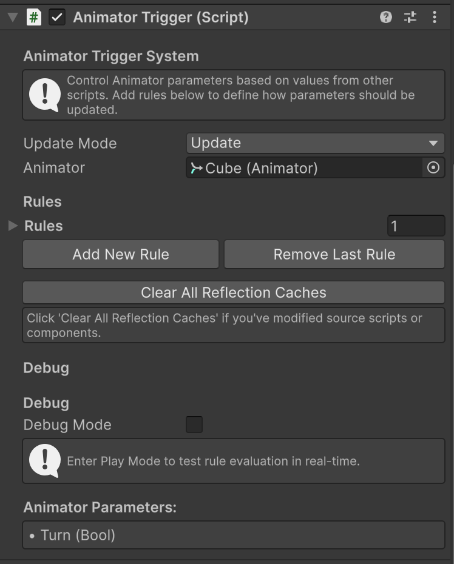
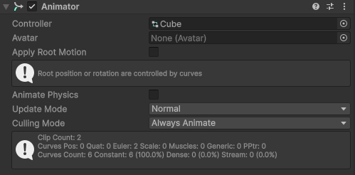

 # <p align = "center">**Animator Trigger System** </p>

 

    A scriptless bridge between coding and visual scripting for Unity Animator parameters

 ## <p align = "center">Description</p>

**Animator Trigger System** is a powerful Unity addon that provides a **no-code solution** for controlling Animator parameters based on values from your scripts. It eliminates the need to write custom Animator controller code while maintaining full flexibility.

### Features

* **Direct Binding** - Map script values directly to animator properties

* **Conditional Logic** - Use if-else rules with comparison operators

* **Nested Property Support** - Access `myList.Count`, `myArray.Length`, `transform.position`, etc

* **Optimized Performance** - Cached reflection with optional debug mode

* **Visual Inspector** - Intuitive dropdowns for all configuration



## <p align = "center">Getting Started</p>

### Prerequisites

* Unity 2020.3 or later 

* Animator component on the GameObject 
    

### Installation

#### Method 1 - Unity Package Manager (Recommended)

1. Open Unity Package Manager
2. Click the '+' button, Add package from git URL
3. Copy the link: [https://github.com/cherryland120/animator-trigger-system.git](https://github.com/cherryland120/animator-trigger-system.git "Cherryland120")

#### Method 2 - Direct Download

1. Download the **.unitypackage** from [tasguard.com/projects/downloadables/animator_trigger_system.unitypackage](https://tasguard.com/projects/downloadables/animator_trigger_system.unitypackage)

2. In Unity: Assets → Import Package → Custom Package

3. Select the downloaded file and click Import

#### Method 3 - Manual Installation

1. Clone or download this repository

2. Copy the `AnimatorTriggerSystem` folder into your Unity project's `Assets` directory


## <p align = "center">Usage</p>

### Basic Setup

1. **Add the Component**
   - Select your GameObject with an Animator

   - Add Component → Animator Trigger System → Animator Trigger

2. **Configure Update Mode**

    ```
   Update        - Evaluates every frame (default)

   FixedUpdate   - Evaluates at fixed intervals (physics)

   LateUpdate    - Evaluates after all Update calls
   ```

3. **Create Rules**

   - Click "Add New Rule"

   - Configure each rule as shown below

### Rule Configuration

#### Direct Binding Example
Monitor a health value and update animator float:

```
Parameter Name: Health
Parameter Type: Float (auto-set)
Rule Type: Direct Binding
Source Object: [Your Player GameObject]
Source Component: PlayerScript
Source Field: currentHealth
```

#### Conditional Logic Example
Set a bool based on list count:

```
Parameter Name: HasItems
Parameter Type: Bool (auto-set)
Rule Type: Conditional
Source Object: [Your Inventory GameObject]
Source Component: InventoryScript
Source Field: items.Count
If Source: Greater Than
Is (int): 0
Then Set To (bool): true
Else Set To (bool): false
```

## <p align = "center">Use Cases</p>

### Character Animation
```
✓ Update "Speed" float based on rigidbody.velocity.magnitude
✓ Set "IsGrounded" bool based on GroundCheck script
✓ Trigger "Attack" when attackCooldown <= 0
```

### UI Animation
```
✓ Show notification icon when messages.Count > 0
✓ Update progress bar based on questProgress value
✓ Animate menu based on selectedIndex
```

### Game State
```
✓ Change environment animator based on timeOfDay
✓ Update enemy behavior based on player distance
✓ Sync audio visualizer with music intensity
```

## <p align = "center">Advanced Features</p>

### Supported Property Types
- **Primitives**: `int`, `float`, `bool`, `string`
- **Unity Types**: `Vector2`, `Vector3`, `Vector4`, `Color`, `Quaternion`
- **Collections**: `.Count`, `.Length` properties
- **Nested**: Access properties of properties (e.g., `transform.position.x`)

### Comparison Operators
- Equals (`==`)
- Not Equals (`!=`)
- Greater Than (`>`)
- Less Than (`<`)
- Greater or Equal (`>=`)
- Less or Equal (`<=`)

### Performance Tips
1. Use appropriate Update Mode (FixedUpdate for physics-based values)
2. Disable unused rules instead of deleting them
3. Keep Debug Mode off in production builds
4. Click "Clear All Reflection Caches" if you modify source scripts

## <p align = "center">Troubleshooting</p>

### "Parameter name is empty"
- **Fix**: Use the dropdown to select a parameter from your Animator Controller
- Make sure your Animator has a Controller assigned

### "No public fields/properties"
- **Fix**: Make sure your field is `public` in your script
  ```csharp
  public List<GameObject> myList;  // Correct
  private List<GameObject> myList; // Wrong
  ```

### "Could not find field or property"
- **Fix**: Check spelling and case sensitivity
- Use dropdowns instead of typing manually
- Click "Clear All Reflection Caches" after script changes

### Value doesn't update
- **Fix**: Enable Debug Mode to see evaluation logs
- Check that the source GameObject is assigned correctly
- Verify the rule is enabled (checkbox)

## <p align = "center">Debug Mode</p>

Enable debug logging to see detailed evaluation information:

```
Inspector → Debug → Check "Debug Mode"
```

**Console Output:**
```
[AnimatorTrigger] Rule 'HasItems': Source value = 3 (type: Int32)
[AnimatorTrigger] Rule 'HasItems': 3 Greater Than 0 = true
[AnimatorTrigger] Rule 'HasItems': Condition MET, result = 'true'
[AnimatorTrigger] Set HasItems = True
```

> **Tip**: Keep Debug Mode off in production for better performance!

---

## <p align = "center">Project Structure</p>

```
AnimatorTriggerSystem/
├── Runtime/
│   ├── AnimatorTrigger.cs           # Main component
│   ├── AnimatorParameterRule.cs      # Rule logic
│   └── AnimatorTriggerSystem.asmdef
└── Editor/
    ├── AnimatorTriggerEditor.cs      # Custom inspector
    ├── AnimatorParameterRuleDrawer.cs # Property drawer
    └── AnimatorTriggerSystem.Editor.asmdef
```

## <p align = "center">Contributing</p>

Contributions are welcome! Please feel free to submit a Pull Request.

## <p align = "center">License</p>

This project is licensed under the MIT License - see the [LICENSE](LICENSE) file for details.

## <p align = "center">Acknowledgments</p>

- Inspired by the need for quick animator prototyping
- Built for the Unity game development community
- Thanks to all contributors and users!

## <p align = "center">Contact & Support</p>

- **Website**: [tasguard.com](https://tasguard.com)
- **Documentation**: [Wiki](https://github.com/yourusername/animator-trigger-system/wiki)
- **Issues**: [GitHub Issues](https://github.com/cherryland120/animator-trigger-system/issues)
- **Email**: tasguardtech@gmail.com

---

I really hope you enjoy it <p align = "right">Anointing Tamunowunari-Tasker</p>